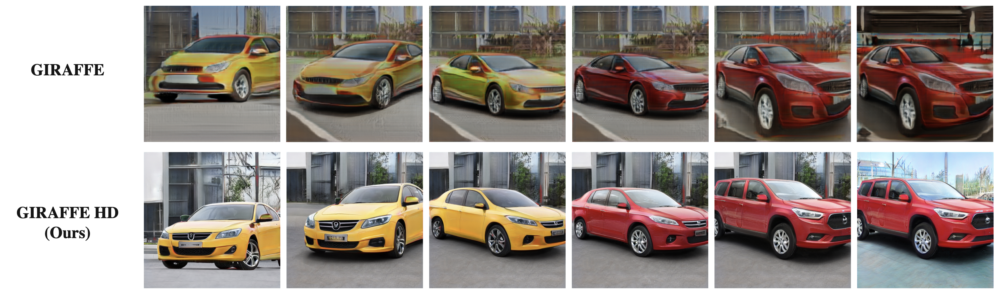

# GIRAFFE HD: A High-Resolution 3D-aware Generative Model

[Project Page](https://austinxy.github.io/project-pages/giraffehd/) <br>
[Paper](https://arxiv.org/abs/2203.14954)




## Usage
Create and activate conda environment 'giraffehd': <br>
```
conda env create -f environment.yml
conda activate giraffehd
```

### Train
Create lmdb dataset: <br>
```
python prepare_data.py --out LMDB_PATH --n_worker N_WORKER --size SIZE DATASET_PATH
```
This will convert images to jpeg and pre-resizes them. <br>

Train model in distributed settings:
```
python -m torch.distributed.launch --nproc_per_node=N_GPU --master_port=PORT train.py \
--wandb --batch BATCH_SIZE --dataset DATASET --size SIZE --datasize DATASIZE LMDB_PATH
```

### Evaluate
Evaluate trained model: <br>
```
python eval.py --ckpt CKPT --batch BATCH_SIZE --control_i CONTROL_I
```
Use `--control_i` to specify which feature to control, <br>
```
0: fg_shape; 1: fg_app; 2: bg_shape; 3: bg_app; 4: camera rotation angle; 5: elevation angle;
7: scale; 8: translation; 9: rotation; 10: bg translation; 11: bg rotation;
```
Change L168-183 in `eval.py` to specify interpolation interval if needed (training intervals will be used if not specified). For example, set `--control_i` to 8, and
```
args.translation_range_min = [0., 0., -0.1]
args.translation_range_max = [0., 0., 0.1]
```
to perform object vertical translation.

### Checkpoints
Model checkpoints are available in [google drive](https://drive.google.com/drive/folders/131hxrDhY1QVvfXGfvper60NYew5nc8Uq?usp=sharing).


## Acknowledgment
Thanks to [giraffe](https://github.com/autonomousvision/giraffe) and [stylegan2-pytorch](https://github.com/rosinality/stylegan2-pytorch)


## License
This repository is released under the MIT license.


## Citation
```
@inproceedings{xue2022giraffehd,
author    = {Yang Xue and Yuheng Li and Krishna Kumar Singh and Yong Jae Lee},
title     = {GIRAFFE HD: A High-Resolution 3D-aware Generative Model},
booktitle   = {CVPR},
year      = {2022},
}
```
